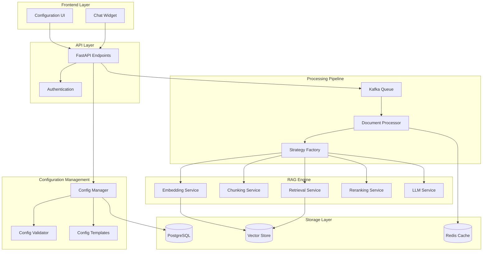
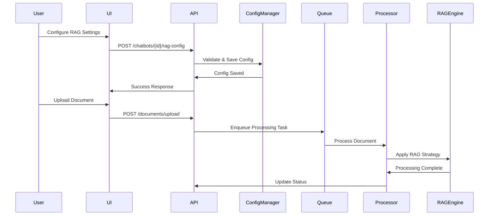

# Advanced RAG Configuration System - Design Document

## Overview

The Advanced RAG Configuration System transforms DocBrain from a basic RAG platform into an enterprise-grade, highly configurable knowledge management solution. The system provides a comprehensive framework for customizing every aspect of the RAG pipeline, from document ingestion through response generation, while maintaining simplicity for non-technical users through intelligent defaults and guided configuration workflows.

The design emphasizes modularity, scalability, and extensibility to support future RAG innovations while ensuring backward compatibility with existing chatbot configurations.

## Architecture

### High-Level Architecture



### Component Interaction Flow



## Components and Interfaces

### 1. Configuration Management Service

**Purpose**: Centralized management of RAG configurations with validation and templating.

**Key Classes**:
```python
class RAGConfigManager:
    async def validate_config(self, config: RAGConfigSchema) -> ValidationResult
    async def save_config(self, chatbot_id: str, config: RAGConfigSchema) -> bool
    async def get_config(self, chatbot_id: str) -> RAGConfigSchema
    async def apply_template(self, template_name: str) -> RAGConfigSchema

class ConfigValidator:
    def validate_model_compatibility(self, config: RAGConfigSchema) -> List[ValidationError]
    def validate_api_keys(self, config: RAGConfigSchema) -> List[ValidationError]
    def estimate_costs(self, config: RAGConfigSchema) -> CostEstimate
```

### 2. Document Processing Pipeline

**Purpose**: Asynchronous document processing with Kafka queue management.

**Key Classes**:
```python
class DocumentProcessor:
    async def enqueue_document(self, document_id: str, config: RAGConfigSchema) -> str
    async def process_document(self, task: ProcessingTask) -> ProcessingResult
    async def get_processing_status(self, task_id: str) -> ProcessingStatus

class KafkaProducer:
    async def send_processing_task(self, task: ProcessingTask) -> str
    
class KafkaConsumer:
    async def consume_processing_tasks(self) -> AsyncIterator[ProcessingTask]
```

### 3. Strategy Factory System

**Purpose**: Dynamic instantiation of RAG components based on configuration.

**Key Classes**:
```python
class RAGStrategyFactory:
    def create_embedder(self, config: EmbeddingConfig) -> BaseEmbedder
    def create_chunker(self, config: ChunkingConfig) -> BaseChunker
    def create_retriever(self, config: RetrievalConfig) -> BaseRetriever
    def create_reranker(self, config: RerankingConfig) -> BaseReranker
    def create_llm(self, config: LLMConfig) -> BaseLLM

class BaseEmbedder(ABC):
    @abstractmethod
    async def embed_documents(self, texts: List[str]) -> List[List[float]]
    
class BaseRetriever(ABC):
    @abstractmethod
    async def retrieve(self, query: str, top_k: int) -> List[RetrievalResult]
```

### 4. Multi-Model Support Services

**Purpose**: Abstraction layer for different embedding and LLM providers.

**Key Classes**:
```python
class EmbeddingService:
    def get_available_models(self) -> List[EmbeddingModelInfo]
    async def create_embedder(self, model_name: str, api_key: str) -> BaseEmbedder

class LLMService:
    def get_available_models(self) -> List[LLMModelInfo]
    async def create_llm(self, model_name: str, config: LLMConfig) -> BaseLLM
```

## Data Models

### Enhanced Configuration Schemas

```python
class EmbeddingConfig(BaseModel):
    model_name: str = Field(..., description="Embedding model identifier")
    provider: Literal["openai", "cohere", "huggingface", "local"] = "openai"
    model_params: Dict[str, Any] = Field(default_factory=dict)
    api_key_ref: Optional[str] = None
    batch_size: int = Field(default=100, ge=1, le=1000)

class ChunkingConfig(BaseModel):
    strategy: Literal["standard", "semantic", "markdown", "window", "hierarchical"] = "standard"
    chunk_size: int = Field(default=1024, ge=100, le=8192)
    chunk_overlap: int = Field(default=200, ge=0, le=1000)
    semantic_threshold: Optional[float] = Field(default=0.8, ge=0.0, le=1.0)
    window_size: Optional[int] = Field(default=3, ge=1, le=10)
    respect_document_structure: bool = True

class RetrievalConfig(BaseModel):
    strategy: Literal["vector", "bm25", "hybrid", "contextual"] = "vector"
    top_k_initial: int = Field(default=50, ge=1, le=200)
    top_k_final: int = Field(default=5, ge=1, le=50)
    hybrid_weights: Optional[Dict[str, float]] = Field(default={"semantic": 0.7, "bm25": 0.3})
    enable_reranking: bool = False
    reranker_model: Optional[str] = None
    similarity_threshold: float = Field(default=0.7, ge=0.0, le=1.0)

class LLMConfig(BaseModel):
    model_name: str = Field(..., description="LLM model identifier")
    provider: Literal["openai", "anthropic", "cohere", "local"] = "openai"
    temperature: float = Field(default=0.1, ge=0.0, le=2.0)
    max_tokens: int = Field(default=1000, ge=100, le=8192)
    system_prompt: Optional[str] = None
    api_key_ref: Optional[str] = None

class AdvancedRAGConfig(BaseModel):
    embedding: EmbeddingConfig
    chunking: ChunkingConfig
    retrieval: RetrievalConfig
    llm: LLMConfig
    visual_processing: Optional[VisualProcessingConfig] = None
    performance_settings: PerformanceConfig = Field(default_factory=PerformanceConfig)
    
class VisualProcessingConfig(BaseModel):
    enable_ocr: bool = True
    enable_colpali: bool = False
    enable_vlm_summarization: bool = False
    ocr_provider: Literal["tesseract", "azure", "google"] = "tesseract"
    vlm_model: Optional[str] = None

class PerformanceConfig(BaseModel):
    cache_embeddings: bool = True
    batch_processing: bool = True
    parallel_workers: int = Field(default=4, ge=1, le=16)
    memory_limit_mb: int = Field(default=2048, ge=512, le=8192)
```

### Processing Task Models

```python
class ProcessingTask(BaseModel):
    task_id: str
    chatbot_id: str
    document_id: str
    config: AdvancedRAGConfig
    priority: int = Field(default=5, ge=1, le=10)
    created_at: datetime
    retry_count: int = 0
    max_retries: int = 3

class ProcessingStatus(BaseModel):
    task_id: str
    status: Literal["queued", "processing", "completed", "failed", "retrying"]
    progress_percentage: int = Field(ge=0, le=100)
    current_step: str
    error_message: Optional[str] = None
    estimated_completion: Optional[datetime] = None
    chunks_processed: int = 0
    total_chunks: int = 0
```

## Correctness Properties

*A property is a characteristic or behavior that should hold true across all valid executions of a system-essentially, a formal statement about what the system should do. Properties serve as the bridge between human-readable specifications and machine-verifiable correctness guarantees.*

### Property Reflection

After analyzing all acceptance criteria, several properties can be consolidated to eliminate redundancy:

- Configuration validation properties (8.1, 8.2, 8.3, 8.4) can be combined into comprehensive validation testing
- Model selection and usage properties (1.2, 1.3, 4.3) follow similar patterns and can be unified
- Processing and queue properties (3.1, 3.2, 3.3) represent different aspects of the same workflow
- Search and retrieval properties (5.1, 5.3, 6.1, 6.3) can be consolidated around search behavior testing

### Core Properties

**Property 1: Model Selection Consistency**
*For any* valid embedding or LLM model selection, the system should use that exact model for all subsequent processing operations until changed
**Validates: Requirements 1.2, 1.3, 4.3**

**Property 2: Configuration Validation Completeness**
*For any* RAG configuration change, the system should validate all interdependent settings and reject invalid combinations with specific error messages
**Validates: Requirements 8.1, 8.2, 8.3, 8.4**

**Property 3: Asynchronous Processing Reliability**
*For any* document upload, the system should enqueue the task asynchronously and provide real-time status updates throughout processing
**Validates: Requirements 3.1, 3.2**

**Property 4: Chunking Strategy Consistency**
*For any* selected chunking strategy and document type, the system should apply the strategy consistently and respect document structure when applicable
**Validates: Requirements 2.2, 2.3, 2.4**

**Property 5: Hybrid Search Composition**
*For any* hybrid search configuration, the system should combine BM25 and semantic scores according to specified weights and return properly ranked results
**Validates: Requirements 5.1, 5.2, 5.3**

**Property 6: Reranking Enhancement**
*For any* query with reranking enabled, the system should retrieve more initial candidates than the final count and reorder them using the specified reranking model
**Validates: Requirements 6.1, 6.3**

**Property 7: Visual Processing Integration**
*For any* document with visual content, when visual processing is enabled, the system should create both text and visual embeddings for comprehensive search
**Validates: Requirements 7.1, 7.2, 7.4**

**Property 8: Graceful Degradation**
*For any* processing failure (reranking unavailable, visual processing error, queue failure), the system should fallback to alternative methods and continue operation
**Validates: Requirements 6.4, 7.5, 3.3**

**Property 9: Model Switching Impact**
*For any* embedding model change, the system should require reprocessing of existing documents and notify users of the impact
**Validates: Requirements 1.4**

**Property 10: Contextual Retrieval Adaptation**
*For any* query with conversation history, contextual retrieval should produce different results than the same query without context
**Validates: Requirements 6.2**

## Error Handling

### Configuration Validation Errors

**Model Compatibility Issues**:
- Detect incompatible embedding-LLM model combinations
- Provide specific recommendations for compatible alternatives
- Prevent configuration save until conflicts are resolved

**API Key Validation**:
- Validate API keys before saving configuration
- Test connectivity to model providers during validation
- Provide clear error messages for authentication failures

**Resource Constraint Violations**:
- Validate chunk sizes against model context limits
- Check memory requirements for selected models
- Warn about performance implications of configuration choices

### Processing Pipeline Errors

**Queue Processing Failures**:
- Implement exponential backoff retry logic (1s, 2s, 4s, 8s, 16s)
- Maximum 5 retry attempts before marking as failed
- Dead letter queue for permanently failed tasks
- Automatic cleanup of stale processing tasks

**Model Service Failures**:
- Graceful degradation to fallback models when primary models fail
- Circuit breaker pattern for external API calls
- Timeout handling for long-running model operations
- Rate limiting compliance for external APIs

**Document Processing Errors**:
- Partial processing recovery for multi-document batches
- Detailed error logging with document-specific context
- User notification system for processing failures
- Automatic retry for transient failures

### Runtime Error Recovery

**Memory Management**:
- Automatic batch size reduction when memory limits are exceeded
- Garbage collection triggers for large document processing
- Memory usage monitoring and alerting

**Performance Degradation**:
- Automatic scaling of processing workers based on queue depth
- Dynamic adjustment of batch sizes based on system performance
- Fallback to simpler strategies when complex operations timeout

## Testing Strategy

### Dual Testing Approach

The Advanced RAG Configuration System requires both unit testing and property-based testing to ensure comprehensive coverage:

**Unit Tests**: Verify specific examples, edge cases, and integration points between components
**Property Tests**: Verify universal properties that should hold across all inputs and configurations

Together they provide comprehensive coverage: unit tests catch concrete bugs, property tests verify general correctness.

### Property-Based Testing Requirements

**Testing Framework**: Use Hypothesis for Python property-based testing with minimum 100 iterations per property test.

**Property Test Implementation**:
- Each correctness property must be implemented by a single property-based test
- Property tests must be tagged with comments referencing the design document property
- Tag format: `**Feature: advanced-rag-configuration, Property {number}: {property_text}**`

**Test Configuration**:
```python
@given(
    model_name=st.sampled_from(VALID_EMBEDDING_MODELS),
    config=st.builds(EmbeddingConfig)
)
@settings(max_examples=100, deadline=30000)
def test_model_selection_consistency(model_name, config):
    """**Feature: advanced-rag-configuration, Property 1: Model Selection Consistency**"""
    # Test implementation
```

### Unit Testing Requirements

**Configuration Management Tests**:
- Test specific configuration validation scenarios
- Test template application and inheritance
- Test configuration migration between versions

**Integration Tests**:
- Test end-to-end document processing workflows
- Test API endpoint integration with configuration changes
- Test queue processing with various failure scenarios

**Performance Tests**:
- Benchmark processing times for different configurations
- Memory usage testing for large document batches
- Concurrent processing stress tests

### Test Data Management

**Synthetic Data Generation**:
- Generate test documents with varying structures and content types
- Create test configurations covering all supported model combinations
- Generate conversation histories for contextual retrieval testing

**Mock Services**:
- Mock external API calls to model providers
- Simulate various failure scenarios for error handling tests
- Mock Kafka queue operations for isolated testing

### Continuous Testing

**Automated Test Execution**:
- Run property tests on every configuration change
- Execute integration tests for critical path workflows
- Performance regression testing on major releases

**Test Environment Management**:
- Isolated test environments for each configuration variant
- Automated cleanup of test data and resources
- Test result reporting and trend analysis

## Implementation Notes

### Migration Strategy

**Backward Compatibility**:
- Existing chatbot configurations will be migrated to new schema automatically
- Default values will be applied for new configuration options
- Legacy API endpoints will continue to work during transition period

**Phased Rollout**:
1. **Phase 1**: Core configuration management and validation
2. **Phase 2**: Advanced chunking and embedding strategies
3. **Phase 3**: Hybrid search and reranking capabilities
4. **Phase 4**: Visual processing and advanced features

### Performance Considerations

**Caching Strategy**:
- Cache embedding results for frequently accessed documents
- Cache model metadata and compatibility information
- Implement intelligent cache invalidation on configuration changes

**Resource Optimization**:
- Lazy loading of model services to reduce startup time
- Connection pooling for external API calls
- Batch processing optimization for large document sets

**Monitoring and Observability**:
- Comprehensive metrics for processing times and success rates
- Configuration usage analytics for optimization insights
- Real-time alerting for system health and performance issues

### Security Considerations

**API Key Management**:
- Encrypted storage of all API keys using tenant-specific encryption
- Secure key rotation capabilities
- Audit logging for all key access and modifications

**Access Control**:
- Role-based access to advanced configuration features
- Tenant isolation for all configuration data
- Rate limiting and abuse prevention for configuration APIs

**Data Privacy**:
- Ensure no sensitive data is logged during processing
- Implement data retention policies for processing logs
- Secure deletion of cached embeddings when requested